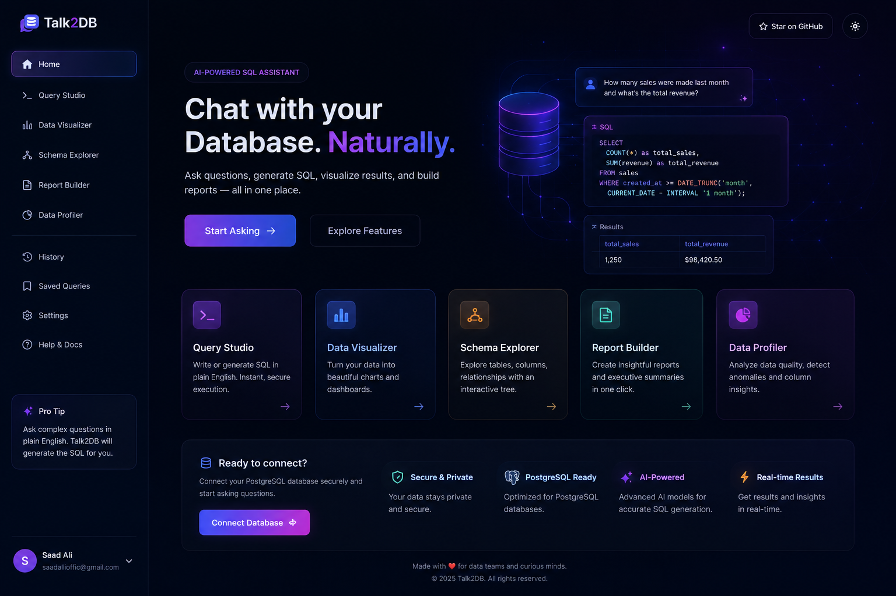

# Talk2DB

A multi-tenant SaaS application that lets you query your own database using plain English. Connect any PostgreSQL database, ask questions in natural language, and get accurate SQL queries with results — powered by Google Gemini and OpenRouter as LLM fallback.



## Features

- **AI-Powered Chat** — translate natural language to SQL using a fine-tuned Gradio model (primary) → Gemini (secondary) → OpenRouter (fallback)
- **Your Own Database** — connect any PostgreSQL database; the app introspects your schema and generates schema-aware queries
- **Query Studio** — run natural-language queries, see results in a table, auto-capped at 500 rows
- **Data Visualizer** — generate bar, line, pie, and area charts from natural-language prompts
- **Report Builder** — generate full reports with LLM-written summaries and insights
- **Schema Explorer** — browse your tables, columns, types, primary keys, and row counts
- **Conversation History** — all chat sessions are persisted and accessible from the sidebar
- **Authentication** — email/password signup and optional GitHub OAuth via NextAuth
- **Admin Panel** — usage stats and user management (gated by `ADMIN_EMAIL`)

## Architecture

```
sql-chat-app/
├── nextjs-app/          # Next.js 16 App Router — frontend + all API routes
│   ├── src/app/         # Pages and API route handlers
│   ├── src/components/  # React UI components
│   ├── src/lib/         # Shared utilities (auth, encryption, LLM, DB, safety)
│   └── prisma/          # Prisma schema (users, conversations, messages, reports)
└── express-backend/     # Legacy Express server (superseded by Next.js API routes)
                         # Kept for reference; not required to run the app
```

**Stack:** Next.js 16 · React 19 · TypeScript · Prisma · PostgreSQL · NextAuth v4 · Tailwind CSS v4 · Recharts · node-postgres · bcryptjs · AES-256-CBC encryption

## Quickstart

### Prerequisites

- Node.js 22 (see `.nvmrc`)
- A PostgreSQL database for the app itself (Neon, Supabase, or local)

### 1. Install dependencies

```bash
# From the repo root
npm install
```

### 2. Configure environment variables

```bash
cd sql-chat-app/nextjs-app
cp .env.example .env
```

Edit `.env` and fill in the required values — see `.env.example` for full documentation. Minimum required:

| Variable | Description |
|---|---|
| `DATABASE_URL` | PostgreSQL URL for the app's own database |
| `NEXTAUTH_SECRET` | Random secret — run `openssl rand -base64 32` |
| `NEXTAUTH_URL` | `http://localhost:3000` for local dev |
| `DB_ENCRYPTION_KEY` | 64-char hex key — run `node -e "console.log(require('crypto').randomBytes(32).toString('hex'))"` |
| `GEMINI_API_KEY` | Free Gemini key from [aistudio.google.com](https://aistudio.google.com/apikey) |
| `ADMIN_EMAIL` | Email address that gets admin access |

### 3. Run database migrations

```bash
cd sql-chat-app/nextjs-app
npx prisma migrate deploy   # production migrations
# or for local dev:
npx prisma db push
```

### 4. Start the dev server

```bash
cd sql-chat-app/nextjs-app
npm run dev
```

App runs at `http://localhost:3000`.

## API Routes

| Method | Path | Description |
|--------|------|-------------|
| `POST` | `/api/auth/register` | Create a new account |
| `GET/POST` | `/api/auth/[...nextauth]` | NextAuth handlers |
| `GET` | `/api/conversations` | List conversations |
| `GET/DELETE` | `/api/conversations/[id]` | Get or delete a conversation |
| `POST` | `/api/chat` | Send a chat message |
| `POST` | `/api/query` | Natural-language → SQL → results |
| `GET` | `/api/schema` | Introspect connected database schema |
| `POST` | `/api/visualize` | Generate a chart from a prompt |
| `POST` | `/api/report` | Generate a data report |
| `POST` | `/api/report/narrative` | Generate LLM narrative for a report |
| `GET/POST` | `/api/report/save` | Save / list saved reports |
| `POST` | `/api/user/connect-db` | Connect a user database |
| `DELETE` | `/api/user/connect-db` | Disconnect the user database |
| `GET/PATCH` | `/api/user/profile` | Get or update user profile |
| `GET` | `/api/admin/stats` | Admin: usage stats (admin only) |
| `DELETE` | `/api/admin/users/[id]` | Admin: delete a user (admin only) |

## Running Tests

```bash
cd sql-chat-app/nextjs-app
npm test
```

100 tests across 6 suites covering auth, chat parsing, SQL safety, schema introspection, visualizer, and error formatting.

## Environment Variables

See `sql-chat-app/nextjs-app/.env.example` for a fully documented list of all variables.

## Troubleshooting

- **`DB_ENCRYPTION_KEY` errors** — must be exactly 64 hex characters (32 bytes). Regenerate with the command in `.env.example`.
- **Auth not working** — ensure `NEXTAUTH_URL` matches the URL you're accessing the app on.
- **AI not responding** — set at least one of `GEMINI_API_KEY` or `OPENROUTER_API_KEY`. The app tries Gemini first, then falls back to OpenRouter.
- **Admin panel inaccessible** — ensure `ADMIN_EMAIL` is set and matches the email you signed in with.
